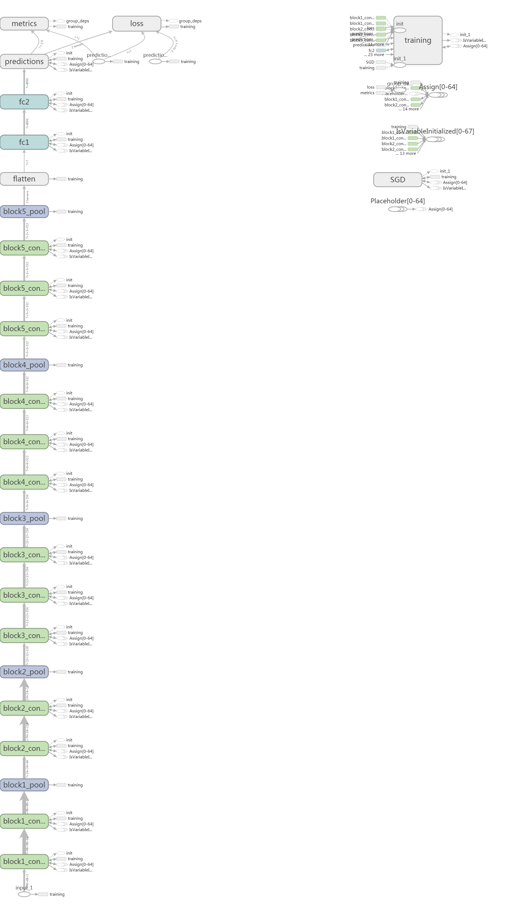
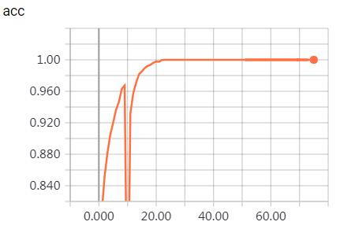
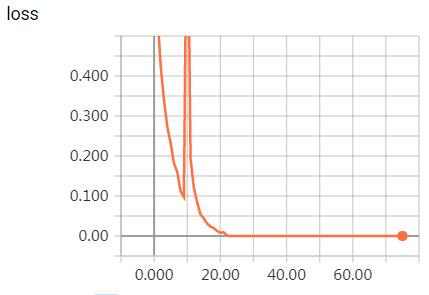
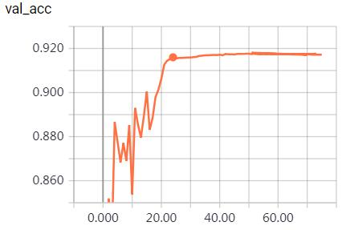
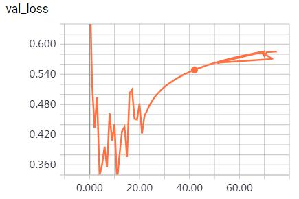
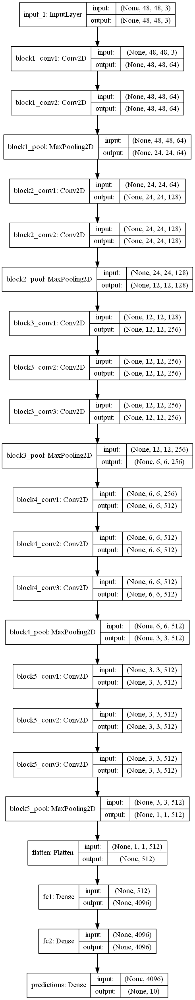

所谓的迁移学习，就是将某个模型在某个数据库上的物体分类能力或特征提取能力应用到另一个数据库，这些“能力”本质上就是模型的权重，用大型数据库上预训练的模型的权重初始化新模型，可以更快训练好新模型。对于某个分类任务，使用迁移学习时，如果数据量比较大，则可以先将预训练模型中提取特征层的权重载入，修改分类层的输出，然后在整个网络上训练，这样比使用随机初始化权重更快达到收敛；如果数据量小，数据类型与预训练模型的数据类型相似，则冻结特征提取层，然后将分类层设计为线性分类器，然后训练分类层；如果数据量小，数据类型与预训练模型的数据类型不相似，则仅使用特征提取层中提取低级特征的层，将其冻结，然后将分类层设计为线性分类器，然后训练分类层。下面将介绍如何使用keras实现transfer learning，使用了cifar10数据库和vgg16模型。

# 一、从model zoo下载imagenet预训练模型
	
# 二、模型设计
特征提取层保持不变，将分类层的最后一个全连接层的单元个数修改为当前数据库的类别个数。
	在模型训练时，使用预训练模型中特征提取层的权重初始化新模型对应的层。
	
	base_model = VGG16(include_top=False, weights='imagenet', input_shape=input_shape)
    x = base_model.output
    x = Flatten(name='flatten')(x)
    x = Dense(4096, activation='relu', name='fc1')(x)
    x = Dense(4096, activation='relu', name='fc2')(x)
    predictions = Dense(classes, activation='softmax', name='predictions')(x)
    model = Model(inputs=base_model.input, outputs=predictions)
	
对于small dataset，需要冻结特征提取层或低级特征提取层：  
	
	for layer in base_model.layers:  
		layer.trainable = False
	
# 三、模型编译  
指定优化器、损失函数、评估函数。  

    optimizer = keras.optimizers.Adam(lr=0.001)
    model.compile(optimizer=optimizer,
                  loss=keras.losses.categorical_crossentropy,
                  metrics=['accuracy'])
	
# 四、模型训练
此处需要指定epochs。batch_size在flow_from_directory中指定。
	
	tensorboard = keras.callbacks.TensorBoard(log_dir=log_dir)
    checkpointer = keras.callbacks.ModelCheckpoint(filepath=ckpt_filepath)

    history = model.fit_generator(generator=train_generator,
                        steps_per_epoch=len(train_generator),
                        epochs=epochs,
                        verbose=1,
                        callbacks=[tensorboard, checkpointer],
                        validation_data=test_generator,
                        validation_steps=len(test_generator),
                        initial_epoch=initial_epoch,
                        workers=4)
	
tensorboard可视化结果：  
*graphs*:

  
*scalars*:  

  

   

*plot_model*:  
  

# 五、模型评估
评估模型的性能   

	score_evaluate = model.evaluate_generator(generator=test_generator,
                                              steps=len(test_generator),
                                              workers=4)
	    
	
